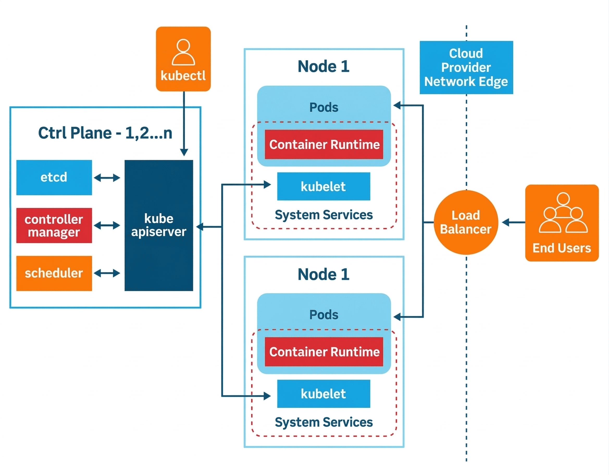

# KIẾN TRÚC KUBERNETES CLUSTER

Ở mức tổng thể, Kubernetes được thiết kế theo mô hình control plane – worker node, trong đó control plane chịu trách nhiệm quản lý trạng thái của hệ thống, còn worker node cung cấp tài nguyên để chạy các workload.

# 1. Kiến trúc tổng thể Kubernestes Cluster

Một Kubernetes cluster thực chất là một hệ thống phân tán gồm nhiều node phối hợp với nhau để chạy containerized workloads. Các thành phần trong cluster được chia thành hai nhóm chính:

- **Control Plane** : quản lý và điều phối toàn bộ cluster
- **Worker Nodes** : nơi các ứng dụng container thực sự chạy

Control Plane đóng vai trò như “bộ não” của hệ thống. Nó nhận các yêu cầu từ người dùng hoặc hệ thống tự động (CI/CD, controllers), sau đó quyết định ứng dụng nên chạy ở đâu, trạng thái mong muốn của cluster là gì, và làm thế nào để duy trì trạng thái đó.

Worker Nodes, ngược lại, là các máy chủ chịu trách nhiệm chạy workload thực tế. Mỗi worker node sẽ chạy các Pod, trong đó Pod chứa một hoặc nhiều container của ứng dụng.

- Khi triển khai một Pod, yêu cầu được gửi tới API Server, sau đó được lưu vào etcd dưới dạng desired state.
- Scheduler sẽ theo dõi API Server, lựa chọn node phù hợp và cập nhật lại thông tin này.
- Kubelet trên worker node sẽ lấy thông tin từ API Server, sau đó sử dụng container runtime để triển khai Pod.
- Cuối cùng trạng thái thực tế được gửi ngược lại về control plane.
# 2. Control Plane Components

Control Plane bao gồm một số thành phần cốt lõi phối hợp với nhau để quản lý cluster.

## 2.1. kube-apiserver:
**API Server là trung tâm giao tiếp của Kubernetes.**

- Mọi thao tác với `cluster`: từ `kubectl`, các `controller`, cho đến các hệ thống tự động hóa, đều đi qua `API Server`.
- API Server cung cấp `RESTful API`, cho phép các thành phần khác đọc và ghi trạng thái của `cluster`. Tất cả dữ liệu cấu hình, trạng thái Pod, Node, Deployment… đều được truy cập thông qua lớp API này.

## 2.2. etcd:

**Khái niệm**: etcd là kho dữ liệu key-value phân tán, dùng để lưu toàn bộ dữ liệu quan trọng của cluster. Kubernetes gọi nó là “consistent and highly-available key value store for all API server data” — tức kho key-value nhất quán và có tính sẵn sàng cao cho dữ liệu của API server.

**Mục đích lưu trữ**: 

- Pod definitions
- Deployment, Service, ConfigMap, Secret
- Thông tin node
- Trạng thái cluster
- Metadata, labels, annotations
- Các bản ghi cấu hình của API objects

Không phải mọi log hay metrics đều nằm ở đây, nhưng các đối tượng cốt lõi của Kubernetes thì nằm ở đây thông qua API server. Vì vậy thường người ta gọi etcd là source of truth của cluster.
- Cấu hình cluster
- Thông tin Node
- Trạng thái Pod
- Secret và config…
- Control Plane sẽ liên tục đọc và ghi dữ liệu vào etcd để đảm bảo trạng thái thực tế của hệ thống khớp với trạng thái mong muốn (desired state).
## 2.3. kube-scheduler: 
**Chịu trách nhiệm quyết định Pod sẽ được chạy trên Node nào. Khi một Pod mới được tạo ra nhưng chưa được gán Node, Scheduler sẽ:**

- Lấy danh sách các Node khả dụng
- Áp dụng các chính sách scheduling (resource, affinity, taints…)
- Chọn Node phù hợp nhất cho Pod
- Sau đó thông tin này sẽ được ghi lại thông qua API Server.
## 2.4. kube-controller-manager:
**Chạy nhiều control loop khác nhau để đảm bảo trạng thái cluster luôn đúng với cấu hình mong muốn. Một số controller phổ biến:**

- Node Controller
- Replication Controller
- Deployment Controller
- Endpoint Controller …
- Các controller này liên tục theo dõi trạng thái cluster và thực hiện các hành động cần thiết. Ví dụ: nếu một Pod bị mất, controller sẽ tạo Pod mới để đảm bảo số replica đúng như khai báo.

# 3. Worker Node Components

Worker Node là nơi các workload thực sự được chạy. Mỗi Worker Node thường bao gồm hai thành phần chính.

## 3.1.kubelet 
**Là agent chạy trên mỗi node. Nó chịu trách nhiệm:**

- Nhận thông tin Pod từ API Server
- Khởi chạy container thông qua container runtime
- Giám sát trạng thái Pod
- Báo cáo trạng thái node và pod về Control Plane
- Có thể xem kubelet như cầu nối giữa Control Plane và máy chủ thực tế.

## 3.2.kube-proxy: 
**Chịu trách nhiệm thiết lập các quy tắc mạng trên node để hỗ trợ Kubernetes Service.**

- Quản lý các rule (thường thông qua iptables hoặc IPVS) để đảm bảo lưu lượng mạng được chuyển đúng đến Pod phía sau một Service.
- Nhờ kube-proxy, các Pod có thể được truy cập thông qua một endpoint ổn định, ngay cả khi Pod phía sau thay đổi.

Từ góc nhìn kiến trúc, Kubernetes được tổ chức theo mô hình phân tách rõ ràng giữa Control Plane và Worker Nodes.

- Control Plane chịu trách nhiệm quản lý toàn bộ cluster và quyết định trạng thái mong muốn (desired state) của hệ thống, trong khi các Worker Nodes sẽ thực thi workload dựa trên trạng thái đó.
- Mọi tương tác với cluster đều đi qua API Server, đóng vai trò là trung tâm giao tiếp giữa người dùng, các thành phần trong hệ thống và các công cụ tự động hóa. 
- Toàn bộ trạng thái và cấu hình của cluster được lưu trữ trong etcd, một cơ sở dữ liệu key-value phân tán.
- Bên cạnh đó, Scheduler và các Controllers liên tục theo dõi trạng thái thực tế của hệ thống và thực hiện các điều chỉnh cần thiết để đảm bảo cluster luôn duy trì đúng trạng thái đã được định nghĩa.

Nhờ cơ chế theo dõi trạng thái liên tục giữa Control Plane và các Worker Nodes, Kubernetes có thể tự động điều chỉnh hệ thống khi có sự thay đổi hoặc sự cố xảy ra. Điều này giúp cluster duy trì trạng thái ổn định và đảm bảo workload luôn được vận hành đúng như mong muốn.