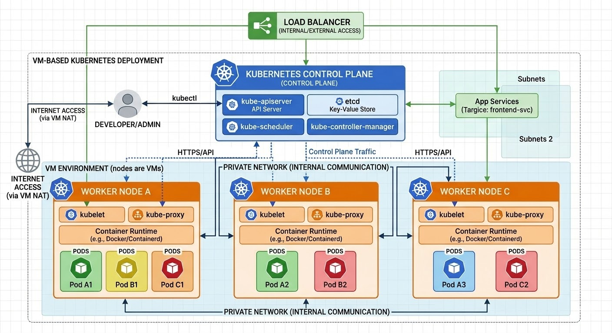
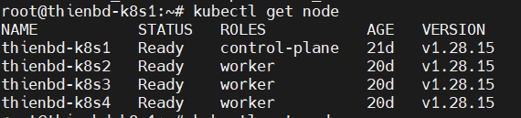

# TRIỂN KHAI CÀI ĐẶT CLUSTER KUBERNETES

# 1. Chuẩn bị trước khi cài đặt
## 1.1. Mô hình triển khai 



Mô hình triển khai bao gồm 1 node master, 3 node worker

## 1.2. Các bước thực hiện

|Bước	|Nội dung	|Master	|Worker|
|---|---|---|---|
|BƯỚC 1	|Cấu hình Hệ thống (Network, Swap, Modules)	|✅	|✅|
|BƯỚC 2	|Cài đặt Container Runtime (CRI-O)	|✅	|✅|
|BƯỚC 3	|Cài đặt Kubeadm, Kubelet, Kubectl	|✅	|✅|
|BƯỚC 4	|Khởi tạo Cluster (Kubeadm init)	|✅	|❌|
|BƯỚC 5	|Cài đặt Network Plugin (Calico)	|✅	|❌|
|BƯỚC 6	|Join các Worker vào Cluster	|❌	|✅|
|BƯỚC 7	|Kiểm tra và Test ứng dụng	|✅	|❌|


# 2. Thực hiện cài đặt 

## 2.1. Cấu hình hệ thống

Thực hiện cấu hình network, swap, modules
- Nếu Swap bật, K8s không thể biết chính xác một Node còn bao nhiêu bộ nhớ thực, dẫn đến việc xếp quá nhiều Pod vào một Node khiến hệ thống bị treo hoặc quá tải.
- Các thông số trong sysctl cho phép Linux đóng vai trò như một bộ định tuyến (router) ảo.
- Module overlay: Đây là driver lưu trữ (Storage Driver) cho phép CRI-O hoặc Docker tạo ra các tầng (layers) hình ảnh container. Nếu không có nó, bạn không thể tạo hoặc chạy các image container một cách hiệu quả.

- Module br_netfilter: Module này cho phép nhân Linux xử lý các gói tin đi qua bridge bằng tường lửa. Nó là "cánh tay đắc lực" để thực hiện lệnh sysctl ở trên. Nếu không load module này, các cài đặt về bridge-nf-call-iptables sẽ không có tác dụng.

**Thực hiện trên tất cả các node (Master và 3 Worker)**

`Cấu hình Network & Tắt Swap` 
Kubernetes yêu cầu tắt Swap để hoạt động ổn định và cần cấu hình bridge network để các Pod có thể giao tiếp qua IP.

- Cấu hình `sysctl`

```
cat <<EOF | sudo tee /etc/sysctl.d/k8s.conf
net.bridge.bridge-nf-call-iptables  = 1
net.bridge.bridge-nf-call-ip6tables = 1
net.ipv4.ip_forward                 = 1
EOF
sudo sysctl --system
```
-  Tắt `Swap`

```
sudo swapoff -a
(crontab -l 2>/dev/null; echo "@reboot /sbin/swapoff -a") | crontab - || true
```

- Load modules cho CRI-O
```
cat <<EOF | sudo tee /etc/modules-load.d/crio.conf
overlay
br_netfilter
EOF
sudo modprobe overlay
sudo modprobe br_netfilter
```

## 2.2. Cài đặt Container Runtime (CRI-O)

**Thực hiện trên tất cả các node (Master và 3 Worker)**

- Đặt biến môi trường
```
export OS="xUbuntu_22.04"
export VERSION="1.28"
```

- Thêm Repositories

```
cat <<EOF | sudo tee /etc/apt/sources.list.d/devel:kubic:libcontainers:stable.list
deb https://download.opensuse.org/repositories/devel:/kubic:/libcontainers:/stable/$OS/ /
EOF
cat <<EOF | sudo tee /etc/apt/sources.list.d/devel:kubic:libcontainers:stable:cri-o:$VERSION.list
deb http://download.opensuse.org/repositories/devel:/kubic:/libcontainers:/stable:/cri-o:/$VERSION/$OS/ /
EOF
```

- Thêm GPG keys

```
curl -L https://download.opensuse.org/repositories/devel:kubic:libcontainers:stable:cri-o:$VERSION/$OS/Release.key | sudo apt-key --keyring /etc/apt/trusted.gpg.d/libcontainers.gpg add -
curl -L https://download.opensuse.org/repositories/devel:/kubic:/libcontainers:/stable/$OS/Release.key | sudo apt-key --keyring /etc/apt/trusted.gpg.d/libcontainers.gpg add -
```

- Cài đặt và kích hoạt

```
sudo apt-get update
sudo apt-get install cri-o cri-o-runc cri-tools -y
sudo systemctl daemon-reload
sudo systemctl enable crio --now
```

## 2.3. Cài đặt Kubeadm, Kubelet & Kubectl

|Công cụ| Chạy ở đâu? | Mục đích chính|
|---|---|---|
| Kubeadm | Master & Worker |Cài đặt và cấu hình ban đầu.|
| Kubelet | Tất cả các Node |Thực thi và duy trì trạng thái Container|
| Kubectl | Master / Máy cá nhân | Gửi lệnh điều khiển từ người dùng đến K8s.|

Các công cụ cốt lõi để giao tiếp và quản lý Kubernetes.

```
sudo apt-get update
sudo apt-get install -y apt-transport-https ca-certificates curl
```

-  Thêm Repo mới của Kubernetes (pkgs.k8s.io)

```
sudo mkdir -p /etc/apt/keyrings
curl -fsSL https://pkgs.k8s.io/core:/stable:/v1.28/deb/Release.key | sudo gpg --dearmor -o /etc/apt/keyrings/kubernetes-apt-keyring.gpg
echo "deb [signed-by=/etc/apt/keyrings/kubernetes-apt-keyring.gpg] https://pkgs.k8s.io/core:/stable:/v1.28/deb/ /" | sudo tee /etc/apt/sources.list.d/kubernetes.list
```

- Tiến hành cài đặt 

```
sudo apt-get update
sudo apt-get install -y kubelet kubeadm kubectl
```

- "Khóa" phiên bản để đảm bảo sự ổn định cho hệ thống.

```
sudo apt-mark hold kubelet kubeadm kubectl
```
## 2.4. Khởi tạo Cluster 

**Chỉ thực hiện trên Master node**

Thay đổi IPADDR bằng IP thực tế của máy Master của bạn.
- **IPADDR="10.0.0.10"**: Đây là địa chỉ IP nội bộ (LAN) của máy Master. Kubernetes cần biết IP này để các máy Worker có thể tìm thấy và kết nối tới nó.

- **POD_CIDR="192.168.0.0/16"**: Đây là dải IP ảo sẽ được cấp cho các Pod.

*Lưu ý*: Dải này không được trùng với dải IP mạng thật của bạn. Giá trị 192.168.0.0/16 là dải mặc định mà plugin mạng Calico (bạn cài ở bước sau) yêu cầu.

```
IPADDR="10.0.0.10" # Thay bằng IP Master của bạn
POD_CIDR="192.168.0.0/16"

sudo kubeadm init --apiserver-advertise-address=$IPADDR --pod-network-cidr=$POD_CIDR --ignore-preflight-errors=Swap
```

Ví dụ : Nếu IP máy Master của bạn là 192.168.10.180/24, thì đây là dải mạng vật lý (Node Network). Để tránh xung đột (IP trùng nhau dẫn đến mất kết nối), chúng ta không nên dùng dải 192.168.0.0/16 cho Pod vì nó bao trùm cả dải 192.168.10.x của bạn.

|Loại mạng|	Dải IP cụ thể|	Trạng thái|
|---|---|---|
|Node Network|	192.168.10.x	|Mạng thật của bạn (Master là .180)|
|Pod Network|	10.244.0.0/16	|Mạng ảo cho Pod (Thay đổi để không trùng)|
|Service Network|	10.96.0.0/12	|Mạng ảo cho Service (Mặc định của K8s)|

- Cấu hình quyền truy cập kubectl cho user hiện tại

```
mkdir -p $HOME/.kube
sudo cp -i /etc/kubernetes/admin.conf $HOME/.kube/config
sudo chown $(id -u):$(id -g) $HOME/.kube/config
```

## 2.5. Cài đặt Calico (Network Plugin)
**Chỉ thực hiện trên Master node**

Để các Pod có thể thấy nhau, bạn cần một CNI.

```
kubectl apply -f https://raw.githubusercontent.com/projectcalico/calico/v3.25.0/manifests/calico.yaml
```

- Vì chúng ta đã đổi dải POD_CIDR sang 10.244.0.0/16, bạn cần tải file cấu hình Calico về và sửa lại một chút trước khi apply:

- Sửa dải IP trong file từ 192.168.0.0/16 thành 10.244.0.0/16
```
sed -i 's/192.168.0.0\/16/10.244.0.0\/16/g' calico.yaml
```

- Áp dụng cấu hình
```
kubectl apply -f calico.yaml
```
## 2.6. Join Cluster 

**Chỉ thực hiện trên Worker node**

- Bạn chạy lệnh sau để lây token join vào cluster 

```
kubeadm token create --print-join-command
```

- Câu lệnh để join cluster có dạng như sau 

```
sudo kubeadm join 10.0.0.10:6443 --token <token-cua-ban> \
    --discovery-token-ca-cert-hash sha256:<hash-cua-ban>
```

# 3. Kiểm tra sau khi cài đặt 

## 3.1. Gán nhãn Worker & Test App
Kubernetes mặc định không hiện Role Worker, bạn nên gán nhãn cho dễ quản lý.


- Gán nhãn (Thay k8s-worker1 bằng hostname thực tế)
```
kubectl label node k8s-worker1 node-role.kubernetes.io/worker=worker
```
- Kiểm tra trạng thái các node
```
kubectl get nodes
```
Kết quả trả về cần có trạng thái ready



- kiểm tra Namespace kube-system

```
kubectl get pod -n kube-system
```
|Trạng thái|	Ý nghĩa	|Cần làm gì?|
|---|---|---|
|0/1 Running|	Pod đang chạy nhưng chưa sẵn sàng phục vụ (lỗi Health Check).|	Chờ 1-2 phút, nếu không đổi thì xem log.|
|CrashLoopBackOff|	Pod khởi động lên rồi bị sập liên tục.|	Nguy hiểm. Cần chạy kubectl logs ngay.|
Pending	|Pod đang "xếp hàng" chờ nhưng không Node nào nhận.|	Kiểm tra xem Node có bị hết RAM/CPU không.|
|ImagePullBackOff|	Không tải được Image từ Docker Hub/Quay.io.|	Kiểm tra kết nối Internet trên Node đó.|