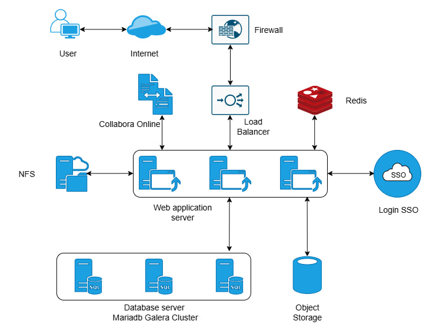

# TRIỂN KHAI CÀI ĐẶT ỨNG DỤNG NEXTCLOUD TRÊN K8S

# 1. Mô hình triển khai 



✅ Dùng LB cứng + Firewall ngoài  
✅ Object Storage (S3) bên ngoài  
✅ Không dùng Collabora  
✅ Triển khai trên K8s
- Web app (Nextcloud pods)  
- Redis  
- MariaDB Galera Cluster  
- SSO (tích hợp sau)  
- NFS (nếu cần shared config/data)  

|Thành phần	|Triển khai trong K8s|
|---|---|
|Firewall	|Ngoài (bạn đã có)|
|Load Balancer	|LB cứng → trỏ vào Ingress Controller|
|Web app	|Deployment (Nextcloud)|
|Redis	|StatefulSet|
|MariaDB Galera	|StatefulSet (3 node)|
|Object Storage	|S3 ngoài (config trong Nextcloud)|
|NFS	|PersistentVolume (RWX)|


# 2. Chuẩn bị môi trường cài đặt cluster  

## 2.1. Tạo namsespace

**Thực hiện trên Master node**

```
kubectl create namespace nextcloud
```

## 2.2. Cài Ingress Controller

- Cài NGINX Ingress Controller

```
kubectl apply -f https://raw.githubusercontent.com/kubernetes/ingress-nginx/main/deploy/static/provider/cloud/deploy.yaml
```

- Kiểm tra sau khi cài đặt 

```
kubectl get pods -n ingress-nginx
```

##  2.3. Kết nối NFS external

Ví dụ với NFS là : 192.168.10.50:/data/nextcloud

- **Tạo file PersistentVolume**

```
apiVersion: v1
kind: PersistentVolume
metadata:
  name: nextcloud-nfs
spec:
  capacity:
    storage: 1Ti
  accessModes:
    - ReadWriteMany
  nfs:
    server: 192.168.10.50
    path: /data/nextcloud
```

Apply file PersistentVolume

```
kubectl apply -f pv.yaml
```

- **Tạo file PVC**

```
apiVersion: v1
kind: PersistentVolumeClaim
metadata:
  name: nextcloud-pvc
  namespace: nextcloud
spec:
  accessModes:
  - ReadWriteMany
  resources:
    requests:
      storage: 1Ti
```

## 2.4. Cài đặt redis 


Tạo file yaml cài đặt redis 

```
apiVersion: apps/v1
kind: StatefulSet
metadata:
  name: redis
  namespace: nextcloud
spec:
  serviceName: redis
  replicas: 1
  selector:
    matchLabels:
      app: redis
  template:
    metadata:
      labels:
        app: redis
    spec:
      containers:
      - name: redis
        image: redis:7
        ports:
        - containerPort: 6379
```

File service 

```
apiVersion: v1
kind: Service
metadata:
  name: redis
  namespace: nextcloud
spec:
  selector:
    app: redis
  ports:
  - port: 6379
```

## 2.5. Cài đặt Mariadb Galera

- Thêm repo cài đặt 

```
helm repo add bitnami https://charts.bitnami.com/bitnami
helm repo update
```